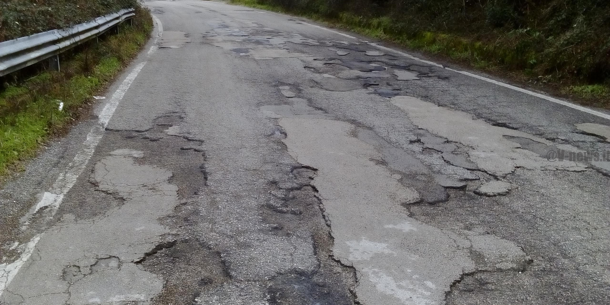

# Road quality detection with smartphone sensors - Group 12  
  

In this project we are going to detect road quality picking up data with smartphone sensors. We are using both Android and iOS phones, 
measuring acceleration (Science Journal App), speed and coordinates (GPS Logger App). Then, with the collected data we’re going 
to classify and predict the goodness of the streets.

## Repository description:  
1. **`Android_final.ipynb`** :  
  This script takes in input records made with android smartphones, clean the data (delate, rearrange columns, edit data type), convert 
  coordinates to street (using reverse geopy scraping geo-information from [Yandex](https://yandex.com/maps) website) 
  and merging GSP with Science Journal file.

2. **`iPhone_final.ipynb`** :  
  This script takes in input records made with iPhones, clean the data (delate, rearrange columns, edit type), convert 
  coordinates to street (using reverse geopy scraping geo information from [Yandex](https://yandex.com/maps) website) and merging GSP with Science Journal file.  
  At the end this script will output a dataset with the same attributes and features of the android one.
  
3. **`Android files`** :  
  This folder includes all the csv files recorded so far with android smartphones. The *gps files* provides data about coorinates, 
  speed meanwhile the *sj file* provides data about acceleration.  
  
4. **`iPhone_Files`** :  
  This folder includes all the csv files recorded so far with iPhones. The *gps files* provides data about coorinates, 
  speed meanwhile the *sj file* provides data about acceleration.  
  
